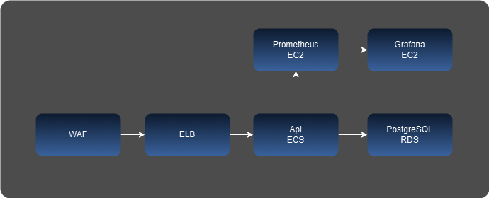

# Arquitetura

O desenho abaixo é um esboço de como ficaria a implementação/implantação da API na AWS

### Componentes

- **WAF** - camada de segurança
- **ELB** - balanceamento de carga
- **ECS** - por ser uma aplicação simples, o ECS atende bem a necessidade de escalabilidade e resiliência. Poderia ser o EKS, mas é mais complexo e provavelmente com custo maior
- **RDS** PostgreSQL - escolhi o postgres por ser um banco robusto e generalista. Pensando em analytics e volume de dados muito grande, trocaria por stream (Kinesis por exemplo) com armazenamento no S3 (orc ou parquet) e usaria uma engine como athena/prestodb para consulta
- Prometheus + Grafana (**EC2**) - escolhi esse modelo pelo baixo custo e alta customização. Pensando em algo pronto, poderia ser um APM de mercado como newrelic/datadog